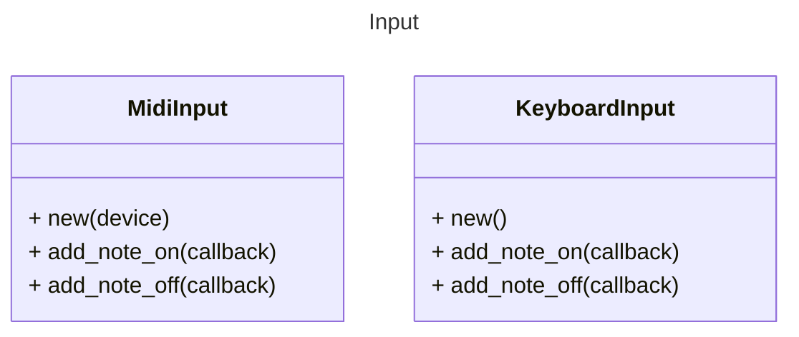
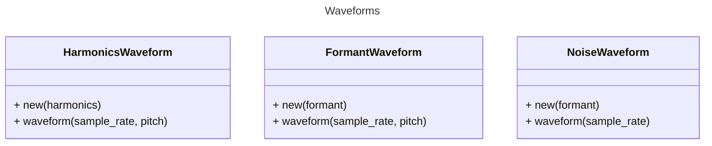
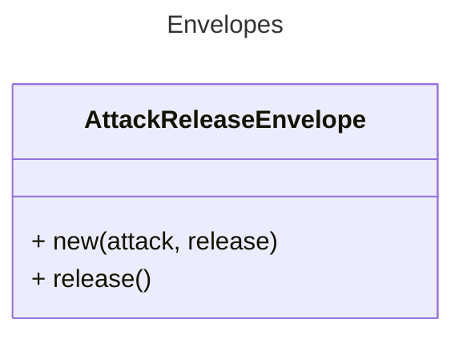
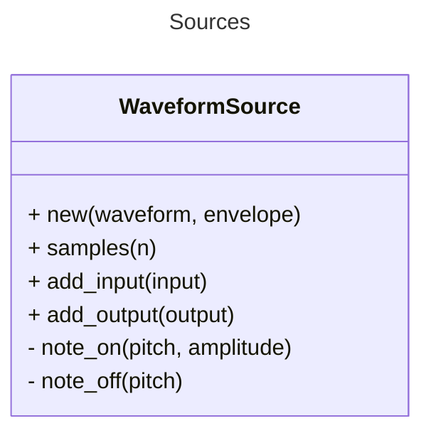
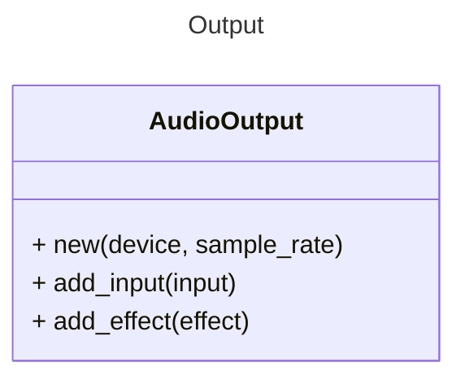

```mermaid
---
title: Input
---
classDiagram
  class MidiInput {
    + new(device)

    + add_note_on(callback)
    + add_note_off(callback)
  }
  class KeyboardInput {
    + new()

    + add_note_on(callback)
    + add_note_off(callback)
  }
```

```mermaid
---
title: Waveforms
---
classDiagram
  class HarmonicsWaveform {
    + new(harmonics)

    + waveform(sample_rate, pitch)
  }
  class FormantWaveform {
    + new(formant)

    + waveform(sample_rate, pitch)
  }
  class NoiseWaveform {
    + new(formant)

    + waveform(sample_rate)
  }
```

```mermaid
---
title: Envelopes
---
classDiagram
  class AttackReleaseEnvelope {
    + new(attack, release)

    + release()
  }
```

```mermaid
---
title: Sources
---
classDiagram
  class WaveformSource {
    + new(waveform, envelope)

    + samples(n)

    + add_input(input)
    + add_output(output)

    - note_on(pitch, amplitude)
    - note_off(pitch)
  }
```

```mermaid
---
title: Output
---
classDiagram
  class AudioOutput {
    + new(device, sample_rate)

    + add_input(input)
    + add_effect(effect)
  }
```